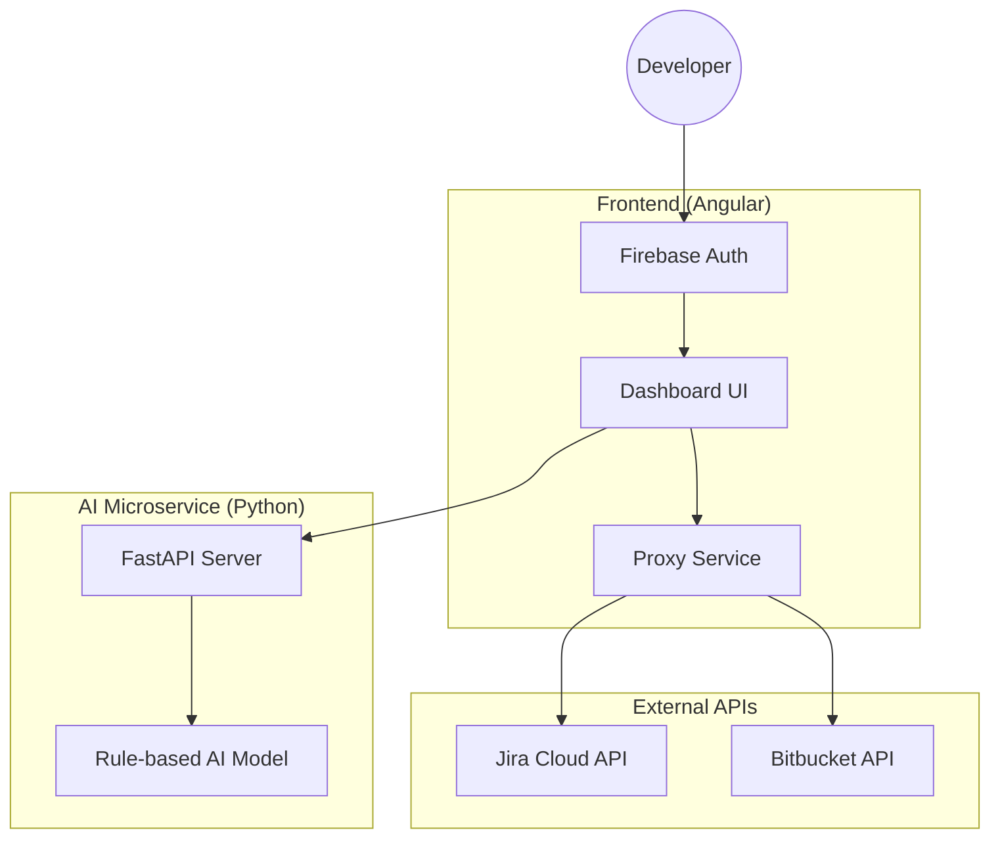

# 🚀 Dev-Helper: Multi-Tenant Developer Productivity Suite

[](https://angular.io/)
[](https://fastapi.tiangolo.com/)
[](https://firebase.google.com/)
[](https://www.python.org/)

**Dev-Helper** is a comprehensive developer productivity platform designed to bridge the gap between technical project management and personal financial insights. Built with a multi-tenant architecture, it segregates professional workflows from personal data, providing a unified yet secure dashboard.

---

## ✨ Key Features

### 🏢 Work Domain (Professional)
*   **Bitbucket & Jira Integration:** Deep integration with Atlassian suite for real-time tracking.
*   **PR Review & Gap Analysis:** Automated identification of missing Jira tickets or open issues in Pull Requests.
*   **Branch & Tag Comparison:** Visual comparison of repository states with associated Jira ticket statuses.
*   **Project Dashboard:** High-level overview of project health and repository activity.

### 🏠 Personal Domain (Private)
*   **AI Crypto Prediction:** Advanced price forecasting using FastAPI-based ML models.
*   **Technical Analysis:** Real-time RSI, MACD, and Moving Average indicators for crypto assets.
*   **Trend Confidence:** AI-driven confidence scores and trend analysis (UP/DOWN/NEUTRAL).

### 🔒 Core Platform
*   **Multi-Tenancy:** Complete isolation between Work and Personal configurations.
*   **Secure Auth:** Firebase-powered authentication with username-based credential management.
*   **Sleek Dark UI:** Modern, responsive interface optimized for developer workflows.

---

## 🛠️ Tech Stack

- **Frontend:** Angular 19+ with SCSS (Dark Mode Optimized)
- **AI Backend:** Python 3.10+ & FastAPI
- **Authentication:** Firebase Auth
- **API Services:** Jira REST API, Bitbucket API, Crypto Exchange APIs

---

## 🚀 Getting Started

### 1. Prerequisites
- Node.js (v20+)
- Python (v3.10+)
- Angular CLI (`npm install -g @angular/cli`)

### 2. Frontend Setup
```bash
# Clone the repository
git clone <repository-url>
cd dev-helper

# Install dependencies
npm install

# Start development server
npm run start
```
The app will be available at `http://localhost:4200`.

### 3. AI Prediction Server Setup
```bash
cd python-ai

# Create virtual environment
python -m venv venv
source venv/bin/activate  # Windows: venv\Scripts\activate

# Install requirements
pip install -r requirements.txt

# Run the server
uvicorn prediction_server:app --reload --port 8000
```

---

## 🏗️ Architecture



---

## ⚙️ Configuration

1.  **Firebase:** Update your Firebase configuration in `src/environments/environment.ts` (or relevant config file).
2.  **Jira/Bitbucket:** Use the **Settings** page within the app to securely store your API tokens (managed via Firebase).
3.  **Proxy:** CORS issues are handled via `proxy.conf.json` for local development.

---

## 📄 License
This project is proprietary and for internal use only.
