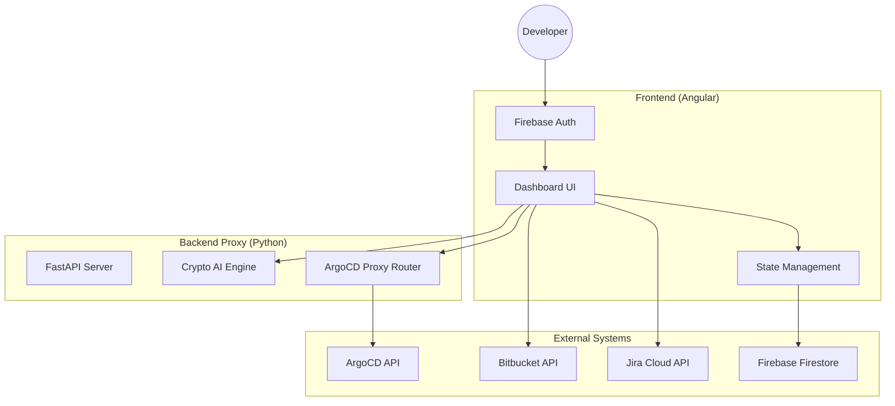

# 🚀 Dev-Helper: Multi-Tenant Developer Productivity Suite

[](https://angular.io/)
[](https://fastapi.tiangolo.com/)
[](https://firebase.google.com/)
[](https://www.python.org/)

**Dev-Helper** is a comprehensive developer productivity platform designed to bridge the gap between technical project management and personal financial insights. Built with a multi-tenant architecture, it segregates professional workflows from personal data, providing a unified yet secure dashboard.

---

## ✨ Key Features

### 🏢 Work Domain (Professional)
*   **ArgoCD Multi-Environment Dashboard:** Aggregate applications across multiple ArgoCD clusters with real-time sync/health status and deep client-side filtering.
*   **Bitbucket & Jira Integration:** Deep integration with Atlassian suite for real-time tracking.
*   **PR Review & Gap Analysis:** Automated identification of missing Jira tickets or open issues in Pull Requests.
*   **Branch & Tag Comparison:** Visual comparison of repository states with associated Jira ticket statuses.
*   **Worked Tickets Report:** Comprehensive analysis of your worklogs and Jira activity within custom date ranges.

### 🏠 Personal Domain (Private)
*   **AI Crypto Prediction:** Advanced price forecasting using FastAPI-based ML models.
*   **Technical Analysis:** Real-time RSI, MACD, and Moving Average indicators for crypto assets.
*   **Trend Confidence:** AI-driven confidence scores and trend analysis (UP/DOWN/NEUTRAL).

### 🔒 Core Platform
*   **Categorized Configuration:** Nested sidebar menu for intuitive management of Bitbucket, Jira, Gemini, and ArgoCD settings.
*   **Multi-Tenancy:** Complete isolation between Work and Personal configurations.
*   **Secure Auth:** Firebase-powered authentication with username-based credential management.
*   **Sleek Dark UI:** Modern, responsive interface optimized for developer workflows.

---

## 🛠️ Tech Stack

- **Frontend:** Angular 19+ with SCSS (Dark Mode Optimized)
- **Backend Microservices:** Python 3.10+ & FastAPI
- **Authentication:** Firebase Auth
- **Data Persistence:** Cloud Firestore (User-isolated and Global configs)
- **External Integration Proxy:** Server-side proxy for ArgoCD to bypass browser CORS.

---

## 🚀 Getting Started

### 1. Prerequisites
- Node.js (v20+)
- Python (v3.10+)
- Angular CLI (`npm install -g @angular/cli`)

### 2. Frontend Setup
```bash
# Clone the repository
git clone <repository-url>
cd dev-helper

# Install dependencies
npm install

# Start development server
npm run start
```
The app will be available at `http://localhost:4201`.

### 3. Backend Microservice Setup
```bash
cd python-ai

# Install requirements
pip install -r requirements.txt

# Run the unified server
uvicorn main:app --reload --port 8000
```

---

## 🏗️ Architecture



---

## ⚙️ Configuration

1.  **Firebase:** Global configurations and user-isolated credentials are stored in Firebase Firestore.
2.  **Settings:** Use the categorized **Configurations** menu to manage:
    - **Bitbucket:** App Passwords and workspace settings.
    - **JIRA:** Base URL, email, and API tokens.
    - **Gemini AI:** API keys for code review and prediction interpretation.
    - **ArgoCD:** Global environment definitions (URLs, credentials).
3.  **CORS:** Browser CORS issues for sensitive integrations (like ArgoCD) are handled via the Python proxy at `/python-ai/argocd`.

---

## 🔧 Service Registry

The `SERVICE_REGISTRY` is a central configuration that maps ArgoCD application names (and image aliases) to Bitbucket projects and repositories. This enables automated navigation from the ArgoCD dashboard to the **Branch & Tag Compare** page.

### Configuration Path
`src/app/core/config/service-registry.ts`

### Example Entry
```typescript
BM_INVOICE: {
  displayName: 'BM Invoice',
  project: 'BM',
  repository: 'csi-bm-invoice-java-service',
  aliases: [
    'csi-bm-invoice-java-service',
    'prod-bminvoicejava',
    'bminvoicejava',
  ]
}
```

### Automation Flow
1.  **Single Selection:** Selecting one app in the dashboard allows comparing its current sync tag against the `main` branch.
2.  **Dual Selection:** Selecting two apps from the same service allows comparing their tags side-by-side. 
3.  **Validation:** The system prevents cross-service comparisons and provides toast notifications if a service is missing from the registry.

---

## 📄 License
This project is proprietary and for internal use only.
